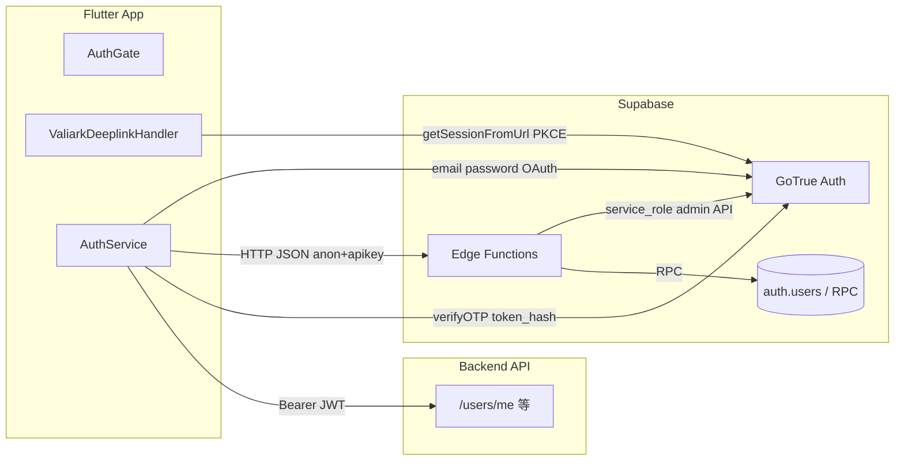
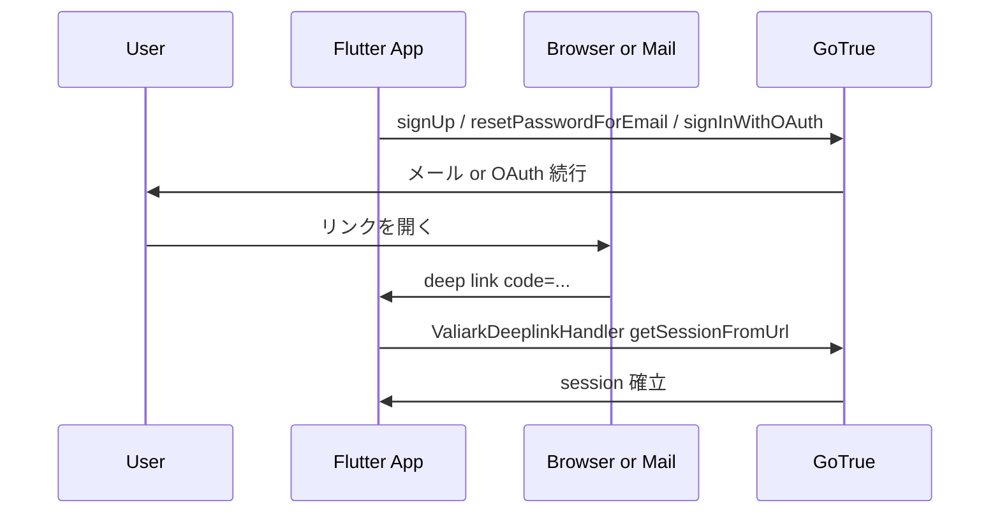
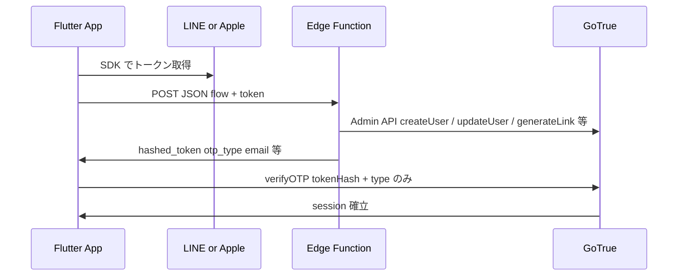

# 認証フロー設計仕様書

本書は **パンダトーク（Panda Talk）モバイルアプリ** の認証について、プロダクト観点とシステム観点を揃えた **設計の正本** である。  
**Dashboard 設定・デプロイ手順・トラブルシュート** は [05_auth.md](./05_auth.md) に寄せ、ここでは **何を保証するか・どの経路でセッションが成立するか** に絞る。

### 図（Mermaid）の確認方法

| 方法 | 手順 |
|------|------|
| **ブラウザプレビュー（推奨）** | [preview/13_auth_flow_spec_diagrams.html](./preview/13_auth_flow_spec_diagrams.html) を開く（初回は CDN で Mermaid を読み込み）。**同一 LINE で複数アプリ**・AuthGate・`account_not_found` 等の**ユーザーフロー別図**もここに集約。[12_multi_app_supabase.md](./12_multi_app_supabase.md) と併読。Finder から開くか `open docs/preview/13_auth_flow_spec_diagrams.html`。 |
| **GitHub** | リポジトリ上で本ファイルを表示するとコードブロックが描画される。 |
| **エディタ** | VS Code / Cursor の拡張（例: *Markdown Preview Mermaid Support*）で Markdown プレビュー。 |
| **オンライン** | [Mermaid Live Editor](https://mermaid.live) に該当コードブロックを貼り付け。 |

---

## 1. 目的と原則

| 原則 | 内容 |
|------|------|
| **単一の身元ストア** | エンドユーザーのアカウントの正は **Supabase Auth（`auth.users`）** — **UID・メール（または擬似メール）・セッション** のみ。Dashboard の Providers がすべて `Email` でもよい（Edge + `verifyOTP` のため）。 |
| **アプリ固有プロファイル** | **表示名・ユーザーコード・アイコン・一言** などは **`panda_profiles` 等のアプリ別テーブル**が正本。Dashboard の Display name / Provider type は統一・運用の対象にしない。 |
| **Valiark 横断** | 同一 Supabase プロジェクトを複数アプリで共有。**Redirect URL はアプリごと**（Panda Talk: `io.valiark.pandatalk://callback` / `PANDA_TALK_AUTH_REDIRECT_URL`）。Dashboard には利用する URI をすべて登録。 |
| **二種類のセッション確立** | (A) **ブラウザ／メール経由の PKCE** と (B) **ネイティブ IdP → Edge → `verifyOTP(token_hash)`** を明示的に分けて扱う。 |

---

## 2. コンポーネント構成

| コンポーネント | 役割 |
|----------------|------|
| **AuthGate** | 未ログイン時はオンボーディング／ログイン・新規登録へ遷移。ログイン済みまたはゲストなら `MainApp`。起動直後にdeeplinkハンドラを1回だけ起動。 |
| **ValiarkDeeplinkHandler** | [AppConfig.authRedirectUrl] のスキーム（既定 `io.valiark.pandatalk`）の **PKCE `code` 付き** URI だけ `getSessionFromUrl`。**二重処理禁止**（initialLink と stream の両方対策）。 |
| **AuthService** | 各プロバイダ呼び出し・`verifyOTP`・サインアウト・パスワードリセット・プロファイル同期トリガの前提となる API。 |
| **line-auth-native / apple-auth-native** | IdP トークンを検証し、`auth.users` 上のユーザー解決・`app_metadata` 更新・**マジックリンク用 `hashed_token`** を返す。 |

---

## 3. 認証方式一覧

| 方式 | 画面からの入会 | Supabase クライアント API | セッション確立の仕組み | Deeplink |
|------|----------------|---------------------------|------------------------|----------|
| **メール＋パスワード** | ログイン／新規 | `signInWithPassword` / `signUp` | サインインは即セッション。新規は確認メール → メール内リンク（PKCE） | 要（確認・リセット） |
| **Google** | ログイン・新規で同一 | `signInWithOAuth(google)` | ブラウザ OAuth → `redirectTo` でアプリに戻り **PKCE** | 要 |
| **LINE** | `flow` で挙動切替 | Edge `line-auth-native` → `verifyOTP` | **サーバー発行の `hashed_token` + `type: magiclink`** | 不要（アプリ内完結） |
| **Apple** | 同上 | Edge `apple-auth-native` → `verifyOTP` | 同上 | 不要 |

---

## 4. アプリ内ナビゲーションと状態

### 4.1 ルート状態（AuthGate）

1. **`Supabase.auth` にユーザーあり** → `MainApp`（ログインユーザー）。
2. **ゲストモード ON**（オンボーディングで「はじめよう」等）→ `MainApp`（セッションなし）。
3. **上記以外** → `OnboardingScreen`。ここから `LoginScreen` / `SignupScreen` を **push**。

### 4.2 ログイン検知後の共通動作

- **PandaTalkApp** が `authUserProvider` を購読し、**初回サインイン**時にルートナビを `popUntil(first)` でフラット化。
- 同じタイミングで **`ensureBackendProfile`** を非同期実行し、バックエンド側にプロファイルを確保（失敗してもアプリは起動継続。デバッグログのみ）。

### 4.3 ネイティブ LINE / Apple の `flow`

| アプリ画面 | `NativeAuthFlow` | Edge へ送る `flow` | 仕様上の意味 |
|------------|------------------|---------------------|--------------|
| ログイン | `login` | `"login"` | 既に **LINE UID / Apple `sub` またはメール紐付け済み** のユーザーのみ。未登録なら **`account_not_found`（404）**。**新規 `createUser` しない**。 |
| 新規登録 | `signup` | `"signup"` | 上記が見つからなければ **新規ユーザ作成**（他条件は Edge 内ロジック）。 |

互換: `flow` **未指定** は Edge 側で **signup 扱い**（旧クライアント向け）。

---

## 5. フロー別シーケンス

### 5.1 メール（サインアップ確認・パスワードリセット・Google OAuth）

共通して **`AuthFlowType.pkce`**、`emailRedirectTo` / OAuth の `redirectTo` は **`AppConfig.authRedirectUrl`**（既定 `io.valiark.pandatalk://callback`）。

**重要制約:** `Supabase.initialize` は **`detectSessionInUri: false`**。PKCE の処理は **ValiarkDeeplinkHandler に一本化**（二重 `getSessionFromUrl` で verifier 消失が起きうる）。詳細は [05_auth.md](./05_auth.md)。

### 5.2 LINE / Apple（ネイティブ）

**GoTrue 契約（クライアント）:** `POST /verify` で **`token_hash` を使う場合**、リクエストボディに **`email` / `phone` / `redirect_to` を付けない**。付与すると GoTrue は `Only the token_hash and type should be provided` で拒否する。実装は [AuthService `_verifyNativeOtp`](../lib/infrastructure/auth/auth_service.dart)。

Edge が返す `otp_type` は **`magiclink`** に揃え、アプリは **`OtpType.magiclink`** で `verifyOTP` する。

---

## 6. Edge Function 内部のユーザー解決（設計意図）

以下は **apple-auth-native / line-auth-native** の共通パターンの要約。実装の詳細はリポジトリ内 `supabase/functions/*/index.ts`。

1. **プロバイダ ID で検索** — `get_user_by_apple_id` / `get_user_by_line_id`（`app_metadata.apple_id` / `line_id`）。
2. **見つかれば** — そのユーザーのメールを読み、`app_metadata` を更新し、マジックリンク用トークンを発行。
3. **見つからなければ** — `get_user_by_email`（**大小無視・trim**）で既存メールユーザを探索。
   - **見つかれば** — 「別人のプロバイダ ID が既に付いていないか」チェック（`identity_conflict`）ののち、同一ユーザーにプロバイダ ID を付与してトークン発行。
4. **`flow: login` でどちらも見つからない** — **`account_not_found`（404）**。アプリは `details` をユーザー向けに表示可能。
5. **`flow: signup` でどちらも見つからない** — `createUser`。重複エラー時は **再度 `get_user_by_email` でフォロー**（マイグレーション未適用・表記ゆれ等の救済。完全ではないため運用では DB を正しい状態に保つ）。

**注意:** 「GoTrue 上ではメール重複だが RPC がユーザー ID を返さない」状態は運用・マイグレーション不整合のサイン。[05_auth.md の get_user_by_email](./05_auth.md) と [04_db.md](./04_db.md) を参照。

---

## 7. 識別子とメタデータ

| 項目 | 格納場所 | 用途 |
|------|-----------|------|
| Auth ユーザー ID | `auth.users.id` | 全フローの主キー |
| `apple_id` | `app_metadata`（Apple JWT `sub`） | Apple 同一人物の再ログイン |
| `line_id` | `app_metadata`（LINE `sub`） | LINE 同一人物の再ログイン |
| `provider` | `app_metadata` | 最後に紐づけたプロバイダ表記など |
| メール | `auth.users.email` | メールログイン・`get_user_by_email` |

**競合ポリシー:** 既に **別の** Apple / LINE ID が同じ Auth ユーザーに付いている場合、**なりすまし連結を拒否**し **`identity_conflict`（409）** を返す。

---

## 8. バックエンドプロファイルとの関係

ログインが完了して `User` がストリームに載ったタイミングで、**認可ヘッダ付き** `POST {apiBaseUrl}/users/me` を呼び、アプリ表示用プロファイルをバックエンドに同期する（`ensureBackendProfile`）。

- **API と Supabase** は別ホストでもよい（`AppConfig.apiBaseUrl`）。
- **ローカル Worker** への同期はデバイス実機ではブロックしないよう **非同期・失敗時もクリティカルにしない** 設計。

---

## 9. 設定と契約一覧

| キー / 項目 | 用途 |
|-------------|------|
| `PANDA_TALK_SUPABASE_URL` / `PANDA_TALK_SUPABASE_ANON_KEY` | Supabase 接続（必須） |
| `PANDA_TALK_AUTH_REDIRECT_URL` | PKCE / OAuth / メールのリダイレクト先（Dashboard **Redirect URLs** と完全一致） |
| `valiarkLineChannelId`（`2010102462`） | LINE SDK 既定（valiark-dev 共通） |
| Edge secrets | `SUPABASE_SERVICE_ROLE_KEY`, `LINE_CHANNEL_ID`（`2010102462` と同値） |
| DB | `get_user_by_email` の **case-insensitive** 版 + **service_role への GRANT EXECUTE** |

---

## 10. エラーと UX の対応方針

| 区分 | 例 | アプリ側の期待動作 |
|------|-----|-------------------|
| Edge | `account_not_found` | メッセージ表示。「新規登録」へ誘導可能。 |
| Edge | `identity_conflict` | 説明文案をそのまま表示。 |
| Edge | 5xx + `Failed to create user` 等 | ログに本文を残し、汎用エラーまたは再試行。原因切り分けはサーバー・DB 整合性。 |
| GoTrue | `verifyOTP` 失敗 | メッセージマッピング（ネットワーク・期限切れ等）。 |
| メール | 未確認でログイン試行 | アプリは **サインアウト** の上、確認を促す（`AuthService.signInWithEmail`）。 |

---

## 11. 関連ソース（リポジトリ）

| 領域 | パス |
|------|------|
| 認証サービス | `lib/infrastructure/auth/auth_service.dart` |
| Deeplink | `lib/infrastructure/auth/valiark_deeplink_handler.dart` |
| ゲート | `lib/presentation/auth_gate.dart` |
| プロバイダ | `lib/presentation/providers/auth_providers.dart` |
| 設定 | `lib/config/app_config.dart` |
| 起動時 | `lib/main.dart` |
| Edge | `supabase/functions/line-auth-native/index.ts`, `apple-auth-native/index.ts` |
| DB 補助 | `supabase/migrations/*get_user_by_email*`, `*get_user_by_provider*` |

---

## 12. 改訂履歴

| 日付 | 内容 |
|------|------|
| 2026-05-16 | 初版。PKCE / ネイティブ verifyOTP / `flow` / Edge 解決順序を設計として固定化。 |
| 2026-05-16 | Mermaid 用ブラウザプレビュー [preview/13_auth_flow_spec_diagrams.html](./preview/13_auth_flow_spec_diagrams.html) と確認手順を追加。 |
| 2026-05-16 | プレビュー HTML にマルチアプリ・AuthGate・`account_not_found` / `identity_conflict` / メール重複など**シナリオ別図**と目次を追加。 |
